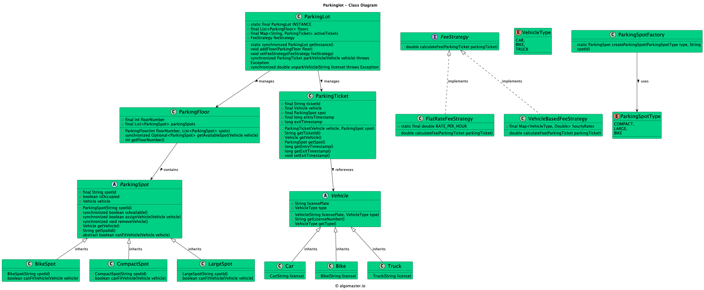

# Designing a Parking Lot System

## 10 Clarifying Questions
1. Will there be multiple levels in the parking lot?
2. What kinds of vehicles will be parked? 
3. Will their sizes differ?
4. Will there be special spots for certain vehicles?
5. Will the parking lot have a payment system? If so, how will it work?
6. Will parking spots be reserved or can the driver choose any spot?
7. How much functionality will the driver have beyond parking and paying?

1. What types of vehicles will use this parking lot?
2. Will the parking lot have different types of parking spots, or are all spots the same?
3. Is the parking lot made up of just one level, or should we support multiple levels?
4. How should a vehicle be assigned to a spot — should it be automatic, manual, or user-selected?
5. Do we need to track which spots are occupied and which are available in real time?
6. Will vehicles enter and exit through a single point, or are there multiple entry/exit gates?
7. Should we support concurrent access — for example, many vehicles entering or leaving at once?
8. What should happen when a vehicle leaves — do we need to free up the spot automatically or manually?
9. Do you expect the system to work across sessions or restarts — should it store its state persistently?
10. Should we expose this system to end users (like drivers) to check availability or reserve spots?

## Requirements
1. The parking lot should have multiple levels, each level with a certain number of parking spots.
2. The parking lot should support different types of vehicles, such as cars, motorcycles, and trucks.
3. Each parking spot should be able to accommodate a specific type of vehicle.
4. The system should assign a parking spot to a vehicle upon entry and release it when the vehicle exits.
5. The system should track the availability of parking spots and provide real-time information to customers.
6. The system should handle multiple entry and exit points and support concurrent access.

## UML Class Diagram

## Classes, Interfaces and Enumerations
1. The **ParkingLot** class follows the Singleton pattern to ensure only one instance of the parking lot exists. It maintains a list of levels and provides methods to park and unpark vehicles.
2. The **Level** class represents a level in the parking lot and contains a list of parking spots. It handles parking and unparking of vehicles within the level.
3. The **ParkingSpot** class represents an individual parking spot and tracks the availability and the parked vehicle.
4. The **Vehicle** class is an abstract base class for different types of vehicles. It is extended by Car, Motorcycle, and Truck classes.
5. The **VehicleType** enum defines the different types of vehicles supported by the parking lot.
6. Multi-threading is achieved through the use of synchronized keyword on critical sections to ensure thread safety.
7. The **Main** class demonstrates the usage of the parking lot system.

## Design Patterns Used:
1. Singleton Pattern: Ensures only one instance of the ParkingLot class.
2. Factory Pattern (optional extension): Could be used for creating vehicles based on input.
3. Observer Pattern (optional extension): Could notify customers about available spots.